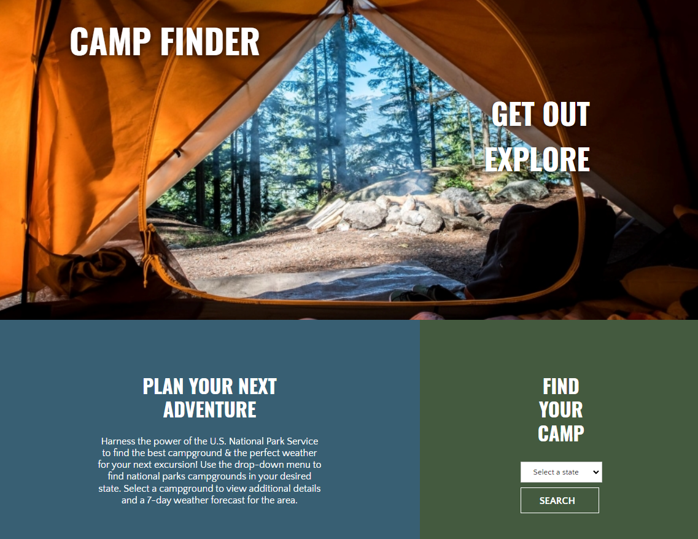
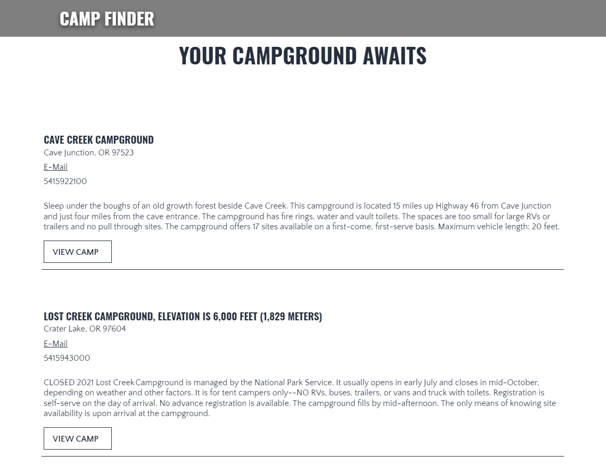
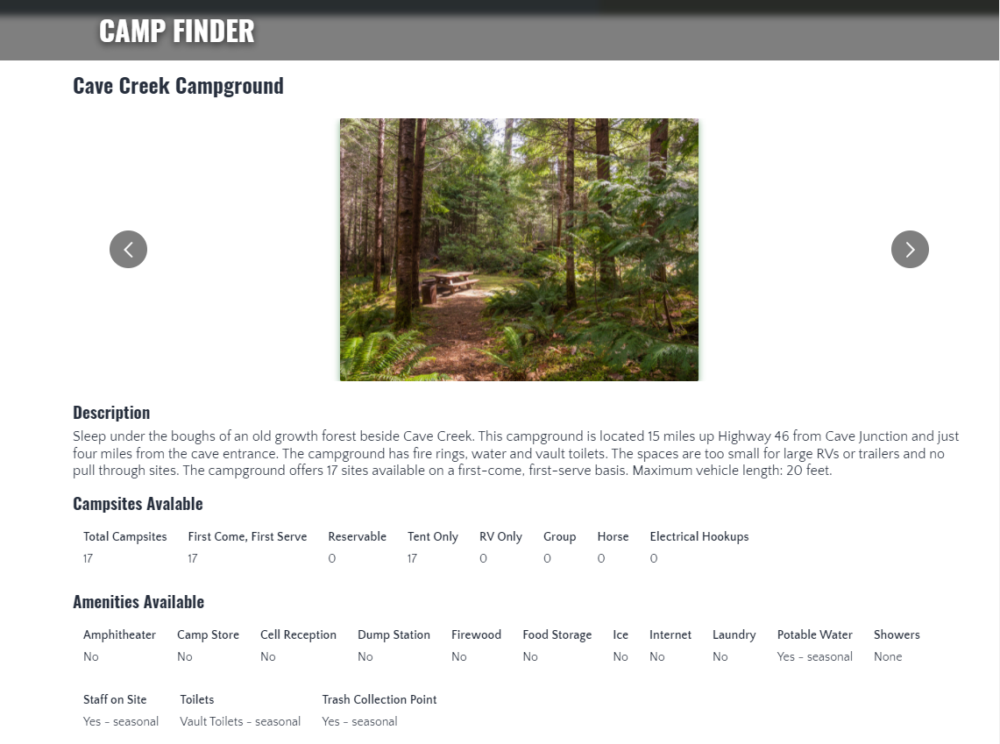
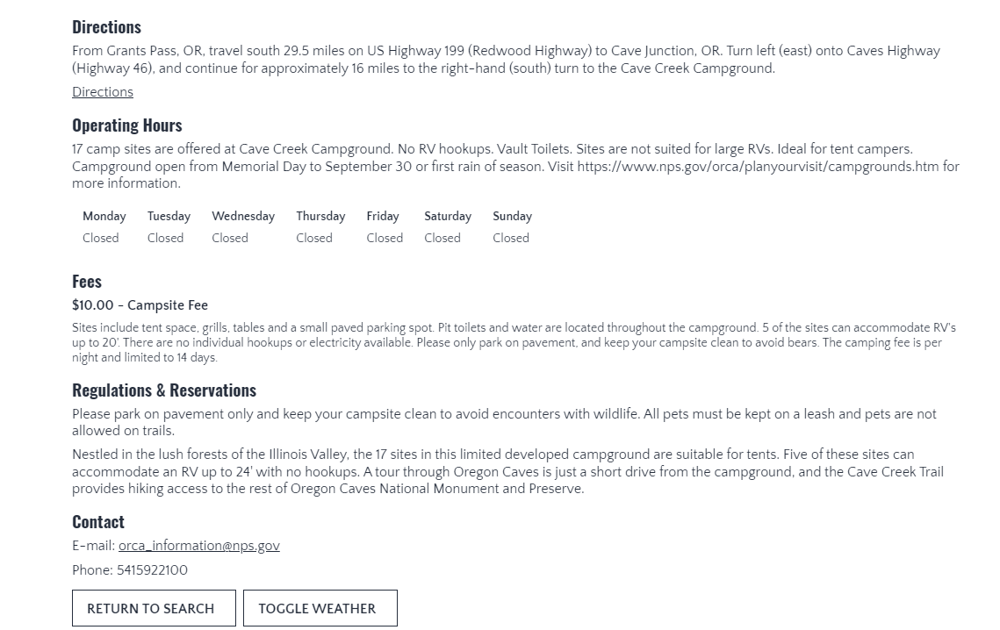
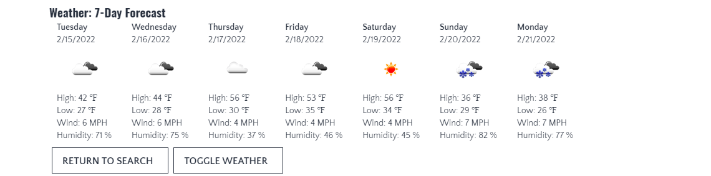

# [Camp Finder](https://spreston4.github.io/camp-finder/)


## Description

Camp Finder is a front-end application for finding your next National Parks camping adventure! The user can select a state to view all National Parks campgrounds. After selecting a campground, the user can see relevant campground data sucha as fees, types of camp sites, hours of operaiton, amenities, etc. They are also presented with photos of the campgrounds and the option to view a 7-day weather forecast for the area - all helpful things when deciding where & when to pitch your tent!

- [Deployed Camp Finder application](https://spreston4.github.io/camp-finder/)

- [GitHub Repo for the Camp Finder application](https://github.com/spreston4/camp-finder)

## Table of Contents

- [Intallation](#installation)
- [Usage](#usage)
- [Technologies Used](#technologies-used)
- [Finished Product](#finished-product)
- [Contact Me](#contact-me)

## Installation

1.  Download the project to the location of your choice.
2.  Navigate to the project directory.
3.  From the root of the directory, install the project with the following command:

```
npm install
```

4. Create a .env file in the root of the directory.
5. Copy the contents of the .env.sample file into your .env file.
6. Replace 'YourNpsApiKeyHere' with your National Parks Service API key.
7. Replace 'YourOpenWeatherApiKeyHere' with your Open Weather API key.

## Usage

1. Navigate to the the project directory.
2. To run locally, run the following command from the root of the directory:

```
npm start
```

3. The user can select a state to view National Parks campgrounds.
4. After selecting 'Search', a list of National parks campgrounds is populated. The user is presented with a short description & contact info (if available) for each campground.
5. Select 'View Camp' to view additional information for the selected campground.
6. The user is present with a carousel of images (if available), campsite description, amenity information, accessibility information, directions, operating hours, fees, regulation & reservation information, and contact information for the selected campground.
7. Select 'Toggle Weather' to view a 7-day forecast for the selected campground.
8. Select 'Return to Search' to return to the list of campground for the seleced state.
9. At any time, the user can select a different state from the dropdown menu to view different camps.

## Technologies Used

Built in Visual Studio with:

- React.js
- JavaScript
- CSS Modules
- National Parks Service API
- Open Weather API

## Finished Product

- [Deployed Camp Finder application](https://spreston4.github.io/camp-finder/)











## Contact Me

Questions, comments, or concerns about this project? Contact via e-mail or checkout my GitHub!

- GitHub: [spreston4](https://github.com/spreston4)

- E-mail: [sam.preston11@gmail.com](mailto:sam.preston11@gmail.com)
